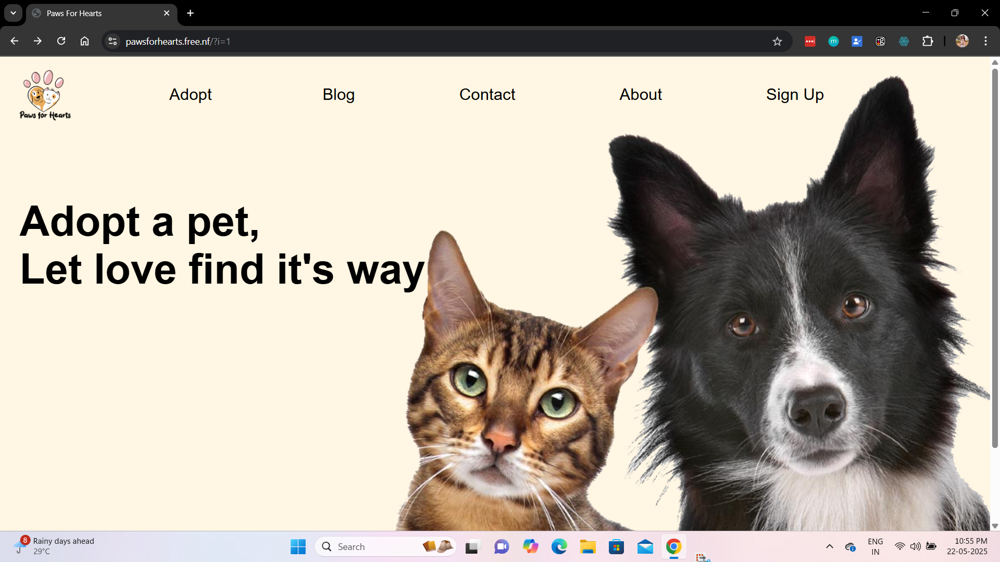
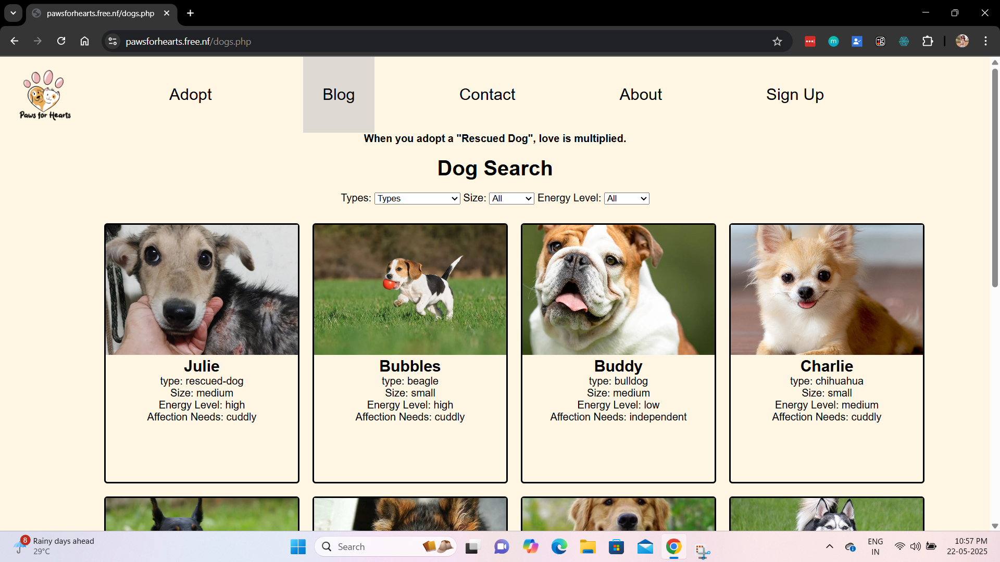
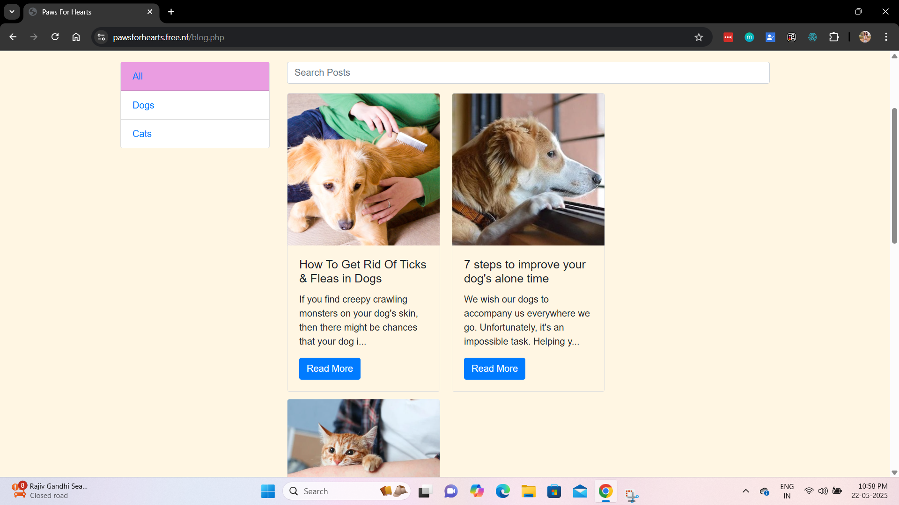
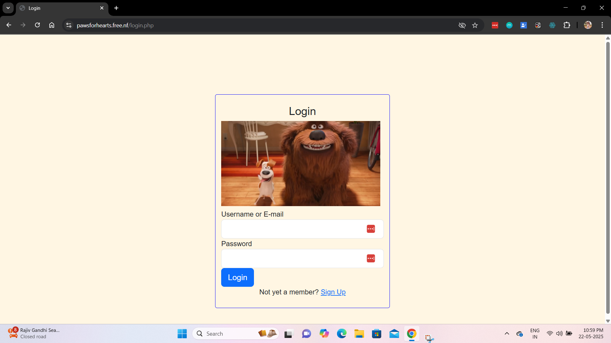

# Paws for Hearts – Rescue Animal Adoption Website

A PHP & MySQL-powered web platform built to help rescued animals find loving homes.  
Includes user registration, pet filtering features, and dedicated sections for blogs, contact, and more.

---

## Features

- View adoptable **dogs and cats**
- Filter by **type, size, and energy level**
- Functional **user registration** system (signup with validation)
- Blog section with stories and updates
- Contact page to reach the team
- About page with project mission
- Responsive design with light CSS (no framework)

---

## Tech Stack

- **Frontend**: HTML, CSS
- **Backend**: JavaScript, PHP  
- **Database**: MySQL  
- **Web Server**: Apache (via XAMPP)

---

## Installation

1. **Clone the Repository**

   ```bash
   git clone https://github.com/priyankamorajkar/paws-for-hearts.git
   cd paws-for-hearts
   ```
2. Set Up the Local Server

- Place the folder in your htdocs (XAMPP) or Sites (MAMP)

- Start Apache & MySQL

3. Create the Database

- Open phpMyAdmin and create a database named pawsforhearts

- Create a users table

---

## Screenshots

<table>
    <tr>
        <td></td>
        <td></td>
    </tr>
    <tr>
        <td></td>
        <td></td>
    </tr>
</table>

---

## Mission
"Every rescued paw deserves a second chance."
Paws for Hearts exists to bridge rescued animals with caring adopters through a clean and functional website experience.

---

## License
This project is licensed under the MIT License.

---

## Author: Priyanka Morajkar
